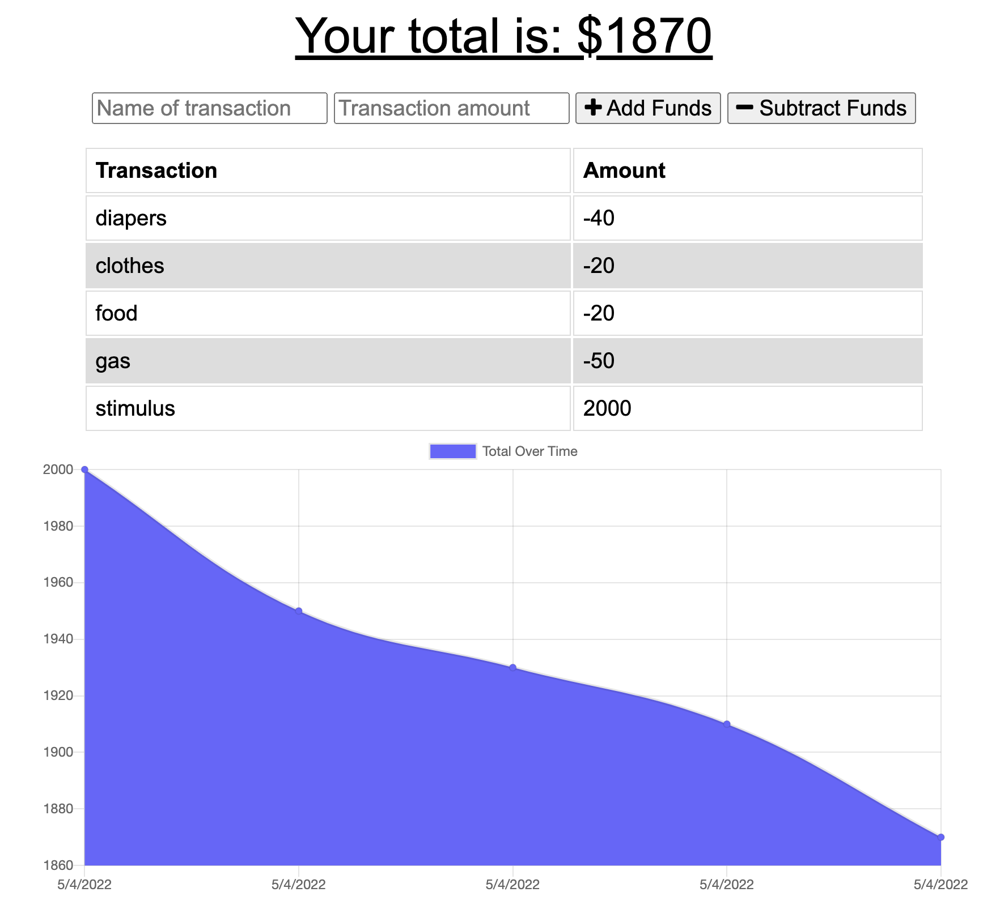

# Budget Tracker 

## Table Of Contents 
<li>Description</li>
<li>Images</li>
<li>Installation</li>
<li>Packages Used</li>
<li>Contact</li>

## Description
* Budget Tracker app used to monitor your spending
* Budgeting made easy to deposit / withdraw funds to keep yoyu finances in order
* Lets the user constantly update expenses with or without internet connection
* gives the user the ability to track funds while offline and automatically update once reconnected to the interenet 

## Images 





##  Installation 

- Download or clone repository 
-Use a text editor to view all coding , Visual Studio ( recommended )
- Within the command line: 
* Open up the ``` command line ``` with in VS code 
* Run ```npm init ``` 
* Followed By: 
- ``` npm i mongoose ```
- ``` npm i express ``` 
- ``` npm i compression ``` 
- ``` npm i morgan ``` 
- ``` npm i nodemon``` ( optional )
- run node:    ``` node (filename).js ``` 

## Packages Used
* Node.js 
* express 
* Mongoose 
* Compression 
* Mogan
* Nodemon (optional)

## Contact 

<a href="https://github.com/santosangel1126"> GitHub: Angel Santos 